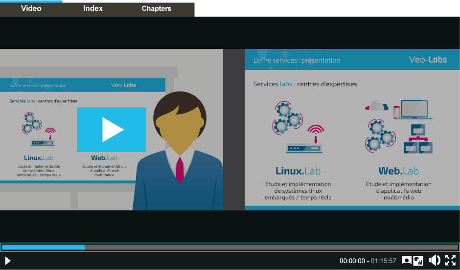

# Introduction

OpenVeo Player defines an AngularJS directive **ov-player** :

```html
<ov-player
  ov-data="data"
  ov-full-viewport="isFullViewport"
  ov-time="isTimeDisplayed"
  ov-fullscreen-icon="isFullscreenIconDisplayed"
  ov-volume-icon="isVolumeIconDisplayed"
  ov-mode-icon="isModeIconDisplayed"
  ov-settings-icon="isSettingsIconDisplayed"
  ov-language="en"
  ov-player-type="html"
  ov-auto-play="true"
></ov-player>
```

This directive creates a video player with images synchronization and chapters.



# Include player CSS

```html
<link rel="stylesheet" type="text/css" href="lib/openveo-player/dist/openveo-player.css">
```

# Set player root

OpenVeo player needs to be aware of its root path to load AngularJS partials.

```html
<script>
  // Set ovPlayerDirectory to openveo-player root path
  // This is used by openveo-player to get partials
  // Do not forget the trailing slash !
  var ovPlayerDirectory = "lib/openveo-player/";
</script>
```

**Nb :** **ovPlayerDirectory** must be defined before including the OpenVeo Player script.

# Include scripts

```html
<link rel="stylesheet" type="text/css" href="lib/angular/angular.min.js">
<link rel="stylesheet" type="text/css" href="lib/openveo-player/dist/openveo-player.min.js">
```

# Attributes

**ov-player** directive attributes helps you customize the player.

## ov-data

Sets player data, synchronize images, chapters and cut.

```javascript
$scope.data = {
  mediaId : '34532ezr54sdf87', // The id of the video
  timecodes : { // Timecodes
    0 : { // Timecode in milliseconds (0 ms)
      'image' : { // Image to display at 0 ms
        'small' : 'slide_00000.jpeg', // Small version of the image
        'large' : 'slide_00000_large.jpeg' // Large version of the image
      }
    },
    1200 : { // Timecode in milliseconds (1200 ms)
      'image' : { // Image to display at 1200 ms
        'small' : 'slide_00001.jpeg', // Small version of the image
        'large' : 'slide_00001_large.jpeg' // Large version of the image
      }
    }
    ...
  },
  files : [ // The list of video files (only for "html" player)
    {
      width : 640, // Video width for this file
      height : 360, // Video height for this file
      link : 'http://pathToSmallMP4.mp4' // Video url
    },
    {
      width : 1280, // Video width for this file
      height : 720, // Video height for this file
      link : 'http://pathToHDMP4.mp4' // Video url
    },
    ...
  ],
  thumbnail : '/1439286245225/thumbnail.jpg', // The media thumbnail (only for "html" player)
  chapters : [ // Chapters
    {
      name : 'Chapter 1', // Chapter name
      description : 'Chapter 1 description', // Chapter description
      value : 0.04 // Chapter timecode in percent (percentage of the video)
    },
    {
      name : 'Chapter 2', // Chapter name
      description : 'Chapter 2 description', // Chapter description
      value : 0.3 // Chapter timecode in percent (percentage of the video)
    }
    ...
  ],
  cut : [ // Cut information (begin and end)
    {
      type : 'begin', // Cut type
      value : 0 // Begin timecode (percentage of the media)
    },
    {
      type : 'end', // Cut type
      value : 0.9 // End timecode (percentage of the media)
    }
  ]
}
```

```html
<ov-player
  ...
  ov-data="data"
></ov-player>
```

## ov-full-viewport (optional)

Indicates if player must take the full viewport or not. **This must be an assignable variable evaluated as a boolean.** (Default to false)

```javascript
$scope.isFullViewport = false;
```

```html
<ov-player
  ...
  ov-full-viewport="isFullViewport"
></ov-player>
```

## ov-time (optional)

Indicates if video time / duration must be displayed or not. **This must be an assignable variable evaluated as a boolean.** (Default to true)

```javascript
$scope.isTimeDisplayed = true;
```

```html
<ov-player
  ...
  ov-time="isTimeDisplayed"
></ov-player>
```

## ov-fullscreen-icon (optional)

Indicates if fullscreen icon must be displayed or not. **This must be an assignable variable evaluated as a boolean.** (Default to true)

```javascript
$scope.isFullscreenIconDisplayed = true;
```

```html
<ov-player
  ...
  ov-fullscreen-icon="isFullscreenIconDisplayed"
></ov-player>
```

## ov-volume-icon (optional)

Indicates if volume icon must be displayed or not. **This must be an assignable variable evaluated as a boolean.** (Default to true)

```javascript
$scope.isVolumeIconDisplayed = true;
```

```html
<ov-player
  ...
  ov-volume-icon="isVolumeIconDisplayed"
></ov-player>
```

## ov-mode-icon (optional)

Indicates if mode icon must be displayed or not. **This must be an assignable variable evaluated as a boolean.** (Default to true)

```javascript
$scope.isModeIconDisplayed = true;
```

```html
<ov-player
  ...
  ov-mode-icon="isModeIconDisplayed"
></ov-player>
```

## ov-settings-icon (optional)

Indicates if settings icon must be displayed or not. **This must be an assignable variable evaluated as a boolean.** (Default to true)

```javascript
$scope.isSettingsIconDisplayed = true;
```

```html
<ov-player
  ...
  ov-settings-icon="isSettingsIconDisplayed"
></ov-player>
```

## ov-language (optional)

Indicates player language. (Default to **en**)

Supported values are :

- fr
- en

```html
<ov-player
  ...
  ov-language="en"
></ov-player>
```

## ov-player-type (optional)

Indicates player type. (Default to **html**)

Supported values are :

- vimeo
- youtube
- html

```html
<ov-player
  ...
  ov-player-type="html"
></ov-player>
```

## ov-auto-play (optional)

Indicates if player must automatically start when media is ready. (Default to **false**)

```html
<ov-player
  ...
  ov-auto-play="true"
></ov-player>
```

## ov-remember-position (optional)

Indicates if player must automatically start at time which video has previously been stopped. (Default to **false**)

```html
<ov-player
  ...
  ov-remember-position="true"
></ov-player>
```